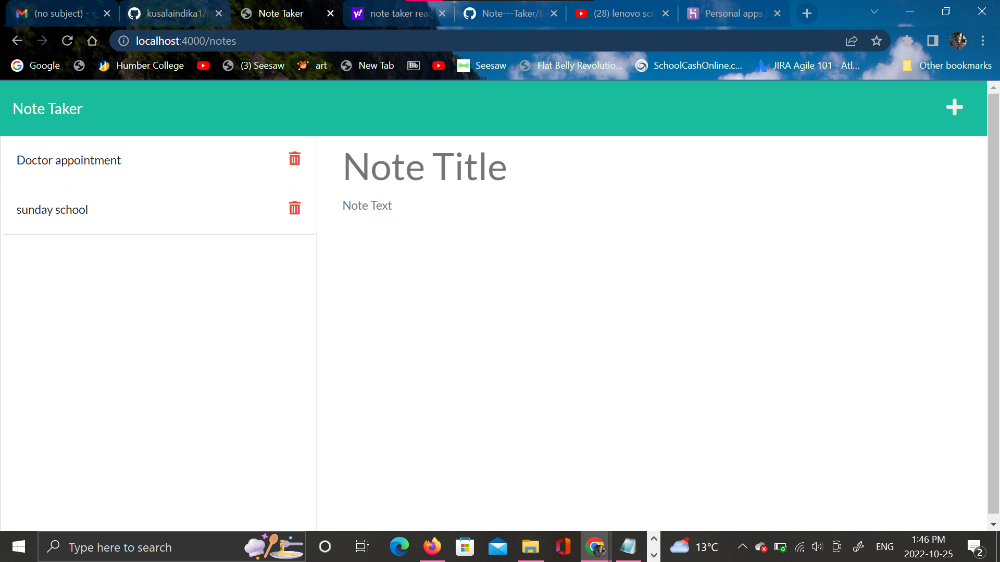
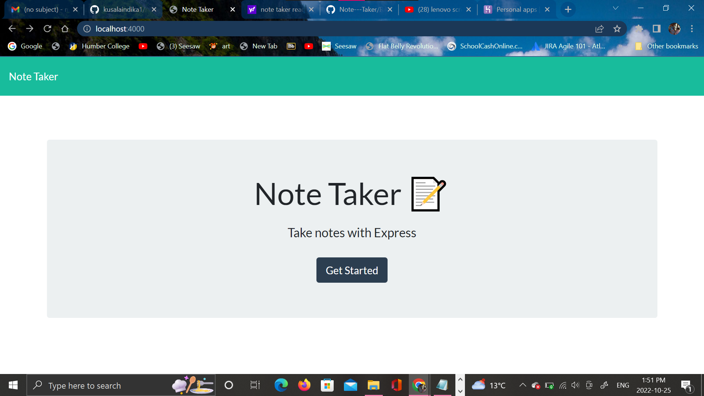

# my-note-taker

# decription

    his website is a note-taker app. It is used to keep track of notes. The user is to create a note and then save a note using the save icon and delete note. This program was created to help a user organize their notes and have one spot to locate all notes. From this project,

# USER STORY

    AS A small business owner I WANT to be able to write and save notes SO THAT I can organize my thoughts and keep track of tasks I need to complete.

# Technology

*HTML
*CSS
*JavaScript#
*Node.js
\*Express.js

# screenshot

# heroku deploy link
https://my-note-taker-12.herokuapp.com/

# GitHub repository link
https://github.com/kusalaindika1/my-note-taker

